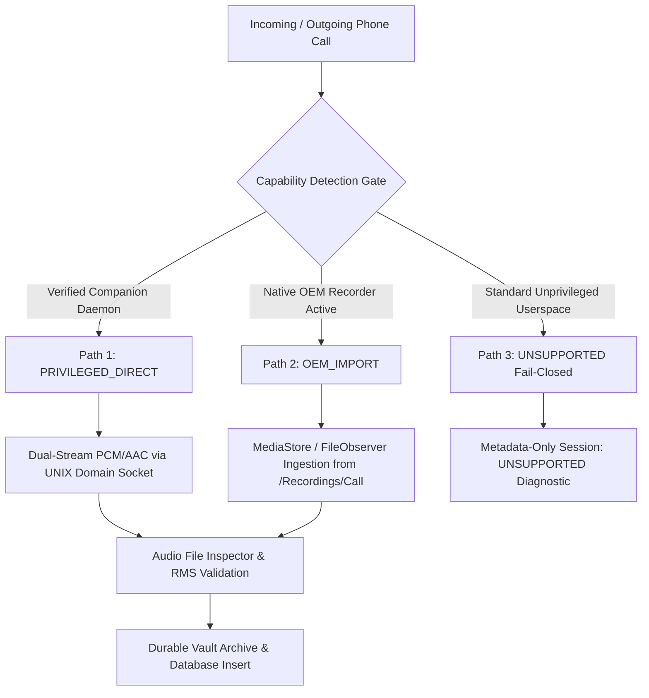

# Architecture Decision Record (ADR) 001: P1 Production Call Capture Architecture

**Status**: PROPOSED (Awaiting User Review / Physical Device Confirmation)  
**Date**: 2026-09-02  
**Part**: P1 — Call Recording  
**Author**: Antigravity Engineering System  

---

## 1. Context & Technical Problem Statement

On Android 9 (API 28) through Android 15 (API 35), the Android Open Source Project (AOSP) enforces strict SELinux policies and `AudioPolicyService` constraints that forbid unprivileged third-party applications (running under standard userspace UIDs $\ge 10000$) from capturing the downlink (remote party) audio stream during cellular (GSM/VoLTE/VoWiFi) voice calls.

Standard Android APIs provide:
- `AudioSource.VOICE_COMMUNICATION`: Intended for VoIP (WebRTC). During telephony calls, AOSP audio policy routes only the uplink (microphone) stream or an unverified acoustic mix when loudspeaker is active.
- `AudioSource.VOICE_CALL` / `VOICE_DOWNLINK`: Protected by `android.permission.CAPTURE_AUDIO_OUTPUT`, which is restricted strictly to system-signed applications (`signature|privileged`) or root (UID 0).

**Mobiltool Engineering Invariant**: Production call capture must yield genuine bidirectional audio (`VERIFIED_BIDIRECTIONAL`). Fallbacks using microphone or acoustic speakerphone echo are strictly forbidden for bidirectional call archiving.

---

## 2. Evaluated Architectural Options

### Option 1: `PRIVILEGED_DIRECT` (Native Companion Daemon over UNIX Domain Socket)
- **Mechanism**: A dedicated standalone native companion binary (`mobiltool_companion`) executed under Root (UID 0) or System (UID 1000).
- **Communication Protocol**:
  - Structured UNIX Domain Socket (`/dev/socket/mobiltool_companion` or `/data/local/tmp/mobiltool_companion.sock`).
  - Cryptographic challenge-response handshake (`AUTH_NONCE` + session token).
  - Bidirectional ping/pong heartbeat for liveness.
  - Raw audio stream transfer via shared memory (`ashmem`/`memfd`) or streaming UNIX socket pipe.
- **Audio Tap**: Accesses raw ALSA hardware endpoints (`/dev/snd/pcmC0D*`) or injects into `audioserver` via `tinyalsa` to capture independent downlink and uplink audio channels.
- **Pros**: 100% device-agnostic across rooted AOSP/LineageOS/Pixel/Samsung devices; independent stream gain control.
- **Cons**: Requires root environment (Magisk, KernelSU, APatch) or system partition modification.

### Option 2: `OEM_IMPORT` (Automated Samsung / Xiaomi MediaStore Ingestion)
- **Mechanism**: Samsung OneUI (in supported CSC regions) and Xiaomi HyperOS include proprietary in-call recorders built into the system dialer (`com.samsung.android.incallui`). These recorders output high-quality, dual-channel audio directly to `/Recordings/Call/` or MediaStore audio collection.
- **Ingestion Pipeline**:
  - `ContentObserver` on `MediaStore.Audio.Media.EXTERNAL_CONTENT_URI`.
  - `FileObserver` on `/storage/emulated/0/Recordings/Call/`.
  - Correlation Engine matching timestamp ($\pm 10$s), phone number, and call duration ($\pm 3$s).
  - Atomic copy/move to Mobiltool protected vault, followed by ISO MP4 structure and RMS validation.
- **Pros**: Zero root required; 100% legitimate manufacturer-supported dual-channel recording.
- **Cons**: Dependent on OEM firmware feature availability and regional CSC configuration.

### Option 3: Standard Userspace Mic Fallback (REJECTED)
- **Why Rejected**: Violates Mobiltool truth invariants. Fails to record downlink audio over earpiece or Bluetooth; captures only ambient room noise and low-quality speakerphone echo.

---

## 3. Decision & Recommended Strategy

We adopt a **Multi-Tier Hybrid Production Architecture**:

1. **Tier 1 (Priority)**: Check for `PRIVILEGED_DIRECT` companion daemon socket handshake. If alive, stream directly via companion.
2. **Tier 2 (Secondary)**: Check for `OEM_IMPORT` capability (Samsung/OEM native call recording folder observer). If active, ingest native recording upon call termination.
3. **Tier 3 (Fallback)**: If neither capability is proven, **FAIL CLOSED** (`CallCaptureTier.UNSUPPORTED_USERSPACE`). Record call session metadata with `recordingQuality = RecordingQuality.UNSUPPORTED` and transparent diagnostic reasons without recording dummy or mic audio.

---

## 4. Physical Device Evidence Required from User

To calibrate the active capture path on the physical target device, the following physical device facts must be confirmed:

1. **Target Phone Model & OS Version**: (e.g. Samsung Galaxy S23/S24 on OneUI 6/7, Pixel on Android 14/15, Xiaomi, etc.)
2. **Root Status**: Is the device rooted with Magisk, KernelSU, or APatch?
3. **Native OEM Call Recording**: Does the phone''s native dialer have an "Auto record calls" option in Phone Settings > Record calls?
